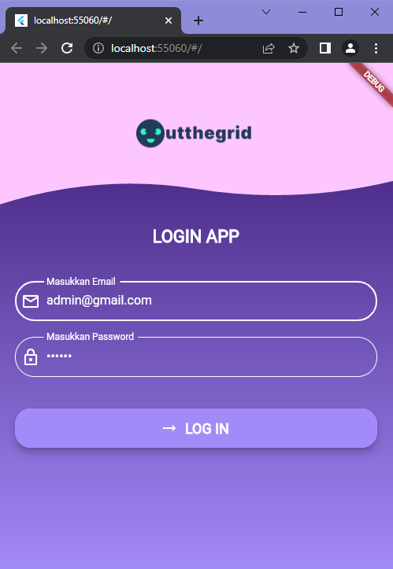
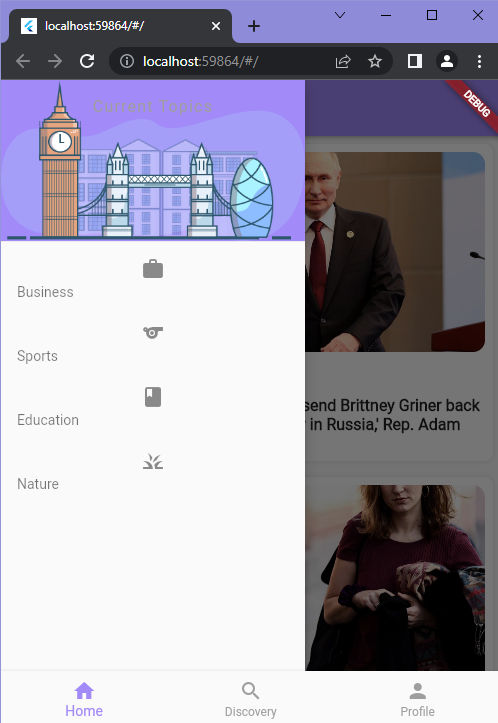

# Outthegrid : Flutter News App using NewsAPI

## Description

Aplikasi Simple menampilkan berita dengan menggunakan NewsAPI

## Preview of the App

<table style="border:1px solid;">
  <tr >
    <th style="text-align: center; border:1px solid;">Discovery Page</th>
    <th style="text-align: center; border:1px solid;">Login Page</th>
    <th style="text-align: center; border:1px solid;">Drawer</th>
  </tr>
  <tr >
    <td style="text-align: center; border:1px solid;padding:1em;">
        
    </td>
    <td style="text-align: center; border:1px solid;padding:1em;">
        
    </td>
    <td style="text-align: center; border:1px solid;padding:1em;">
        
    </td>
  </tr>
  
</table>
 

## Usage
API ini gratis untuk digunakan

